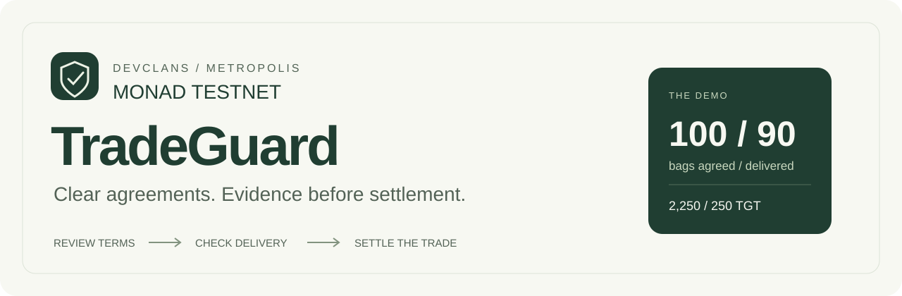

<p align="center">
  
</p>

<p align="center">
  <strong>A delivery dispute should have a clear paper trail.</strong><br />
  Reviewed terms, delivery evidence and Monad testnet escrow, built by DevClans.
</p>

<p align="center">
  <a href="#the-demo">The demo</a> ·
  <a href="#screenshots">Screenshots</a> ·
  <a href="#run-it">Run it</a> ·
  <a href="#monad-testnet">Contracts</a> ·
  <a href="docs/METROPOLIS_SUBMISSION.md">Submission guide</a>
</p>

---

## Why TradeGuard

A buyer orders 100 bags of maize. The supplier delivers 90. The agreement, receipt and payment decision need to tell the same story.

TradeGuard keeps that record together. Qwen extracts draft terms from the agreement, people check and approve them, and delivery evidence records what arrived. If the parties disagree, their named arbitrator decides the split. Each participant withdraws their allocation from escrow.

## The demo

| Agreed | Delivered | Settlement |
| --- | --- | --- |
| 100 bags at NGN 42,000 each | 90 bags; 10 missing | 2,250 TGT to supplier, 250 TGT to buyer |

The invoice is **NGN 4,200,000**. The **2,500 TGT** settlement is a separate test-token amount; there is no currency conversion.

There are two workspaces:

- **Sandbox:** a private rehearsal with simulated roles and balances, saved records and evidence attachments.
- **Monad testnet:** a separate contract workflow with buyer, supplier and arbitrator wallets. Every transaction requires the right wallet signature.

AI helps read the agreement. It does not decide disputes or release payments.

## Screenshots

Local browser captures from the synthetic 100/90-bag demo. These show the application, not completed Monad settlement transactions.

<table>
  <tr>
    <td width="50%"><strong>Trade overview</strong><br /></td>
    <td width="50%"><strong>Delivery shortage</strong><br /></td>
  </tr>
  <tr>
    <td><strong>Settlement record</strong><br /></td>
    <td><strong>Monad workspace</strong><br /></td>
  </tr>
</table>

[Agreement import](docs/screenshots/02-agreement-import.jpg) · [Reviewed Qwen fields](docs/screenshots/03-qwen-review.jpg) · [Activity history](docs/screenshots/06-activity.jpg)

## Run it

Requires **Node 22.13+** and **pnpm**. From the repository directory:

```powershell
pnpm install --frozen-lockfile
if (-not (Test-Path -LiteralPath '.env')) {
    Copy-Item -LiteralPath '.env.example' -Destination '.env'
}
pnpm build
pnpm local
```

Open http://127.0.0.1:5173/ and sign in to the local demo. Stop with Ctrl+C. On Windows, stop the app before rebuilding; restart after changing `.env`.

The local sign-in fixture is for development. Production uses the hosted Site's sign-in boundary. D1/R2 data persists in `.wrangler/state`; keep both local ports private.

| Guide | Contents |
| --- | --- |
| [Local setup](docs/LOCAL_SETUP.md) | Windows commands, Singapore Qwen, environment settings and checks |
| [Sandbox demo](docs/DEMO_GUIDE.md) | Agreement review, evidence, dispute and 90/10 settlement |
| [Monad wallet guide](docs/MONAD_GUIDE.md) | Wallet funding, deployment, TGT faucet and the three-wallet flow |
| [Submission guide](docs/METROPOLIS_SUBMISSION.md) | Portal steps, project details and remaining materials |

`.gitignore` excludes API keys, wallet files, dependencies, builds and local runtime state. Keep actual keys in your ignored `.env`; never commit a wallet private key. `.env.example` contains placeholders only.

## Monad testnet

| Contract | Address |
| --- | --- |
| TGT — six decimals | [`0xfcc80262fccc19b3a833e2453e52316a0edf5f3b`](https://testnet.monadscan.com/address/0xfcc80262fccc19b3a833e2453e52316a0edf5f3b) |
| Escrow | [`0x27ba251f396277a9af8ca7cf2cde4a279582f83a`](https://testnet.monadscan.com/address/0x27ba251f396277a9af8ca7cf2cde4a279582f83a) |

Chain ID: **10143**. Gas: **testnet MON**. TGT has no cash value. Reuse the same deployed contracts for new trades; app restarts do not require deployment.

```powershell
node scripts/verify-testnet.mjs
```

Code, token linkage and decimals passed read-only checks on 2 October 2026. That check returned next trade ID 1. A live three-wallet trade, settlement and withdrawal rehearsal is still outstanding.

## Under the hood

React and TypeScript run on Vinext/Vite. Cloudflare D1 stores sandbox records; R2 stores evidence. The server calls Singapore Qwen Plus for extraction. Solidity and OpenZeppelin implement escrow, and viem connects the wallet UI.

```text
app/                 Screens and authenticated API routes
lib/tradeguard/      Terms, sandbox transitions and extraction
contracts/src/       TGT and escrow contracts
scripts/             Local launcher, deployment and verification
tests/               Domain, extraction and local EVM checks
docs/                Setup, demo, review and submission material
```

The server validates extraction fields and filters source quotes. Buyers and suppliers review the result before saving. Documents stay off-chain; the testnet workflow publishes salted commitments and transaction data.

## Verification

The 2 October check passed TypeScript, production build, **11 domain/extraction tests**, **7 local EVM tests**, and the full persisted API demo, including evidence bytes, 90/10 settlement, both withdrawals and access checks.

```powershell
pnpm exec tsc --noEmit
node --import tsx --test tests/domain.test.ts tests/extraction.test.ts
node scripts/compile-contracts.mjs
node --test tests/contracts.test.mjs
```

With `pnpm local` running:

```powershell
node --import tsx scripts/verify-local-demo.ts
node --import tsx scripts/verify-local-worker.ts
```

The API checks create synthetic records. A successful Qwen sample confirms connectivity and matching fields for that example, not accuracy on other documents. [Full verification record](docs/VERIFICATION.md).

## Metropolis

**Team:** DevClans

| Member | Role |
| --- | --- |
| Ibrahim Rabiu | Developer |
| Mardiyya Sulaiman | UI Developer |

**Suggested track:** Consumer Products & Payments.

- [Project repository](https://github.com/Alhibb/metropolis_tradeguard)
- [Hosted prototype](https://devclans-tradeguard.alhibb.chatgpt.site/) — currently owner-only
- [Official event](https://monad.xyz/developers/hackathons/metropolis)
- [Application portal](https://hackathon.monad.xyz/)

The video will be attached later. Hosted Qwen/contract settings, judge access and the live wallet rehearsal still need completion. The entry has not been submitted. See the [submission checklist](docs/SUBMISSION_STATUS.md) and [ready-to-paste entry](docs/SUBMISSION_ENTRY.md).

## Limits to know

This is a testnet prototype, not audited payment infrastructure. Only the supplied TGT token is supported. Deadlines are advisory after funding; if arbitration is unavailable and the parties refuse a mutual split, funds can stay locked indefinitely.

Evidence declarations do not prove physical delivery. Scanned PDFs need OCR. Sandbox role switching is not multi-user authorization. Do not expose the raw worker without the trusted authentication boundary.

[Contract review](docs/CONTRACT_REVIEW.md) · [Documentation review](docs/CONTENT_REVIEW.md)
